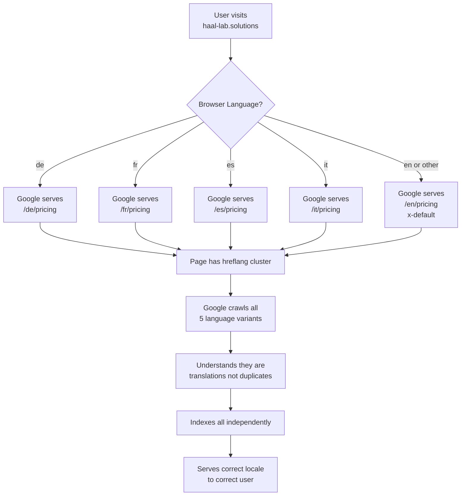
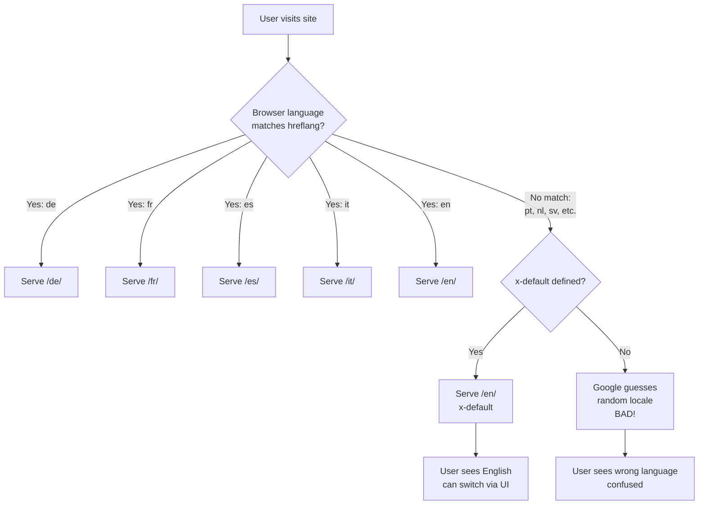

# Multilingual SEO Architecture — Visual Guide

**Project:** haal-lab.solutions Professional Multilingual SEO  
**Date:** 2026-07-18

---

## System Architecture



---

## URL Structure

```
haal-lab.solutions/
│
├── /en/               ← English (default, x-default fallback)
│   ├── pricing/
│   ├── solutions/
│   ├── how-we-work/
│   ├── network/
│   ├── about/
│   ├── contact/
│   └── research/
│       ├── article-1/
│       └── article-2/
│
├── /de/               ← German (Deutsch)
│   ├── pricing/
│   ├── solutions/
│   └── ... (same structure)
│
├── /fr/               ← French (Français)
│   ├── pricing/
│   ├── solutions/
│   └── ... (same structure)
│
├── /es/               ← Spanish (Español)
│   ├── pricing/
│   ├── solutions/
│   └── ... (same structure)
│
└── /it/               ← Italian (Italiano)
    ├── pricing/
    ├── solutions/
    └── ... (same structure)
```

**Key characteristics:**
- ✅ **Subdirectory pattern** (not subdomain or ccTLD)
- ✅ **Consolidates domain authority** (all locales on one domain)
- ✅ **Clear geo-targeting** (Google Search Console can target per locale)
- ✅ **Easy to maintain** (single codebase, single deployment)

---

## Hreflang Cluster (Bidirectional Links)

### Example: German Pricing Page

```
┌─────────────────────────────────────────────────────────────┐
│  https://haal-lab.solutions/de/pricing                      │
│  <head>                                                      │
│    <link rel="canonical"                                     │
│          href="https://haal-lab.solutions/de/pricing" />     │
│                                                              │
│    <link rel="alternate" hreflang="x-default"               │
│          href="https://haal-lab.solutions/en/pricing" />     │
│    <link rel="alternate" hreflang="en"                      │
│          href="https://haal-lab.solutions/en/pricing" />     │
│    <link rel="alternate" hreflang="de"                      │
│          href="https://haal-lab.solutions/de/pricing" />     │ ← Self-reference
│    <link rel="alternate" hreflang="fr"                      │
│          href="https://haal-lab.solutions/fr/pricing" />     │
│    <link rel="alternate" hreflang="es"                      │
│          href="https://haal-lab.solutions/es/pricing" />     │
│    <link rel="alternate" hreflang="it"                      │
│          href="https://haal-lab.solutions/it/pricing" />     │
│  </head>                                                     │
└─────────────────────────────────────────────────────────────┘
         ↓           ↓           ↓           ↓           ↓
    ┌────────┐  ┌────────┐  ┌────────┐  ┌────────┐  ┌────────┐
    │  /en/  │  │  /de/  │  │  /fr/  │  │  /es/  │  │  /it/  │
    │ pricing│  │ pricing│  │ pricing│  │ pricing│  │ pricing│
    └────────┘  └────────┘  └────────┘  └────────┘  └────────┘
         ↓           ↑           ↓           ↓           ↓
         └───────────┴───────────┴───────────┴───────────┘
              ALL pages reference ALL others + themselves
                    (bidirectional cluster)
```

**Critical rules:**
1. ✅ **Self-referencing** — Each page includes its own hreflang
2. ✅ **Bidirectional** — If A links to B, B must link back to A
3. ✅ **Complete cluster** — Every page references ALL language variants
4. ✅ **x-default** — Fallback always points to English (`/en/`)

---

## Code Architecture

### File Structure

```
haal-lab/
│
├── src/
│   ├── lib/
│   │   └── seo.ts                      ← SINGLE SOURCE OF TRUTH
│   │       ├── LOCALES constant         (en, de, fr, es, it)
│   │       ├── generateHreflangAlternates()
│   │       ├── generateHomeHreflangAlternates()
│   │       ├── generateResearchHreflangAlternates()
│   │       └── validateHreflangCluster()
│   │
│   ├── app/
│   │   ├── [locale]/
│   │   │   ├── layout.tsx              ← Uses generateHomeHreflangAlternates()
│   │   │   ├── page.tsx                ← Homepage
│   │   │   ├── pricing/page.tsx        ← Uses generateHreflangAlternates(locale, "/pricing")
│   │   │   ├── solutions/page.tsx      ← Uses generateHreflangAlternates(locale, "/solutions")
│   │   │   ├── how-we-work/page.tsx
│   │   │   ├── network/page.tsx
│   │   │   ├── about/page.tsx
│   │   │   ├── contact/page.tsx
│   │   │   └── research/
│   │   │       ├── page.tsx            ← Research index
│   │   │       └── [slug]/page.tsx     ← Uses generateResearchHreflangAlternates()
│   │   │
│   │   └── sitemap.ts                  ← Generates XML sitemap with hreflang
│   │
│   └── i18n/
│       ├── routing.ts                  ← Locale definitions (en, de, fr, es, it)
│       └── messages/                   ← Translation JSON files
│           ├── en.json
│           ├── de.json
│           ├── fr.json
│           ├── es.json
│           └── it.json
│
└── scripts/
    └── validate-hreflang.js            ← Pre-deploy validator
```

---

## Data Flow

### Before (Manual, Error-Prone)

```
Developer writes page metadata
    ↓
Manually types 6-line hreflang block
    ↓
Easy to forget a locale
    ↓
No validation
    ↓
Deploy
    ↓
Google finds errors
    ↓
Fix manually, redeploy
```

### After (Centralized, Validated)

```
Developer writes page metadata
    ↓
Imports generateHreflangAlternates()
    ↓
One line: ...generateHreflangAlternates(locale, "/page")
    ↓
Function reads LOCALES constant (single source of truth)
    ↓
Generates complete cluster automatically
    ↓
Pre-deploy validator runs: node scripts/validate-hreflang.js
    ↓
Build succeeds
    ↓
Deploy
    ↓
Google sees perfect hreflang clusters
```

---

## Canonical + Hreflang Interaction

### The Golden Rule: Canonical = Self, Hreflang = Others

```
┌──────────────────────────────────────────────────────────────┐
│  WRONG: Canonical fights hreflang (common mistake)           │
│                                                               │
│  /de/pricing:                                                 │
│    <link rel="canonical"                                      │
│          href="https://haal-lab.solutions/en/pricing" />      │ ← WRONG!
│    <link rel="alternate" hreflang="de"                       │
│          href="https://haal-lab.solutions/de/pricing" />      │
│                                                               │
│  Google sees: "Canonical says this is /en/pricing,           │
│                hreflang says it's /de/pricing"               │
│  Result: Hreflang ignored, only /en/ indexed                 │
└──────────────────────────────────────────────────────────────┘

┌──────────────────────────────────────────────────────────────┐
│  CORRECT: Self-referencing canonical (what we do)            │
│                                                               │
│  /de/pricing:                                                 │
│    <link rel="canonical"                                      │
│          href="https://haal-lab.solutions/de/pricing" />      │ ← Self!
│    <link rel="alternate" hreflang="de"                       │
│          href="https://haal-lab.solutions/de/pricing" />      │
│    <link rel="alternate" hreflang="en"                       │
│          href="https://haal-lab.solutions/en/pricing" />      │
│    ... (all other locales)                                    │
│                                                               │
│  Google sees: "This is /de/pricing (canonical),              │
│                and here are the other language versions"     │
│  Result: All locales indexed, relationships understood       │
└──────────────────────────────────────────────────────────────┘
```

**Implementation:**
```typescript
// Our utility enforces this automatically:
export function generateHreflangAlternates(locale: Locale, path: string) {
  const canonical = `${SITE.url}/${locale}${path}`; // ← Self-referencing
  
  const languages = {
    "x-default": `${SITE.url}/en${path}`,
    en: `${SITE.url}/en${path}`,
    de: `${SITE.url}/de${path}`,
    // ... all locales
  };
  
  return { alternates: { canonical, languages } };
}
```

---

## X-Default Fallback Logic



**Why x-default matters:**
- Portuguese user (pt-BR) visits site
- No `/pt/` locale exists
- x-default → serves `/en/` (predictable)
- Without x-default → Google might serve `/it/` or `/es/` (unpredictable)

**Our implementation:**
```typescript
// Always generated:
languages: {
  "x-default": `${SITE.url}/en${path}`, // ← Fallback to English
  en: `${SITE.url}/en${path}`,
  // ... other locales
}
```

---

## Validation Pipeline

```
┌────────────────────────────────────────────────────────────┐
│  Pre-Deployment (Local)                                     │
│                                                              │
│  Developer makes changes                                    │
│     ↓                                                        │
│  Runs: node scripts/validate-hreflang.js                    │
│     ↓                                                        │
│  Checks:                                                     │
│    ✓ All 40 clusters (8 pages × 5 locales)                 │
│    ✓ Bidirectional return tags                              │
│    ✓ x-default present                                      │
│    ✓ Self-referencing canonicals                            │
│    ✓ Absolute URLs                                          │
│    ✓ Valid ISO codes                                        │
│     ↓                                                        │
│  Passes ✅ → Commit and push                                │
│  Fails  ❌ → Fix errors, run again                          │
└────────────────────────────────────────────────────────────┘
         ↓
┌────────────────────────────────────────────────────────────┐
│  Build (CI/CD)                                              │
│                                                              │
│  npm run build                                              │
│     ↓                                                        │
│  Next.js generates static HTML                              │
│     ↓                                                        │
│  Each page gets 6 hreflang tags in <head>                   │
│     ↓                                                        │
│  Sitemap.xml generated with xhtml:link                      │
│     ↓                                                        │
│  Deploy to production ✅                                    │
└────────────────────────────────────────────────────────────┘
         ↓
┌────────────────────────────────────────────────────────────┐
│  Post-Deployment (Production)                               │
│                                                              │
│  Submit sitemap to Google Search Console                    │
│     ↓                                                        │
│  Google crawls all 5 locales                                │
│     ↓                                                        │
│  Validates hreflang clusters                                │
│     ↓                                                        │
│  Indexes all independently                                  │
│     ↓                                                        │
│  Serves correct locale to correct user ✅                   │
│                                                              │
│  Check GSC International Targeting report (Week 1)          │
│  Expected: Zero errors                                      │
└────────────────────────────────────────────────────────────┘
```

---

## Common Failure Modes (Now Prevented)

### 1. Missing Return Tags ❌ → Fixed ✅

**Before:**
```
/en/pricing → links to /de/pricing
/de/pricing → DOES NOT link back to /en/pricing
Result: Google ignores the entire cluster
```

**After:**
```typescript
// Our utility automatically creates bidirectional clusters:
for (const loc of LOCALES) {
  languages[loc] = `${baseUrl}/${loc}${path}`;
}
// Every page references ALL locales (including itself)
```

### 2. Canonical Conflict ❌ → Fixed ✅

**Before:**
```
/de/pricing:
  canonical → /en/pricing  (WRONG)
  hreflang  → /de/pricing
Result: Google only indexes /en/, ignores /de/
```

**After:**
```typescript
// Self-referencing canonical enforced:
const canonical = `${baseUrl}/${locale}${path}`; // Always current locale
```

### 3. Missing x-default ❌ → Fixed ✅

**Before:**
```
User with browser language = Portuguese (pt)
No x-default defined
Result: Google randomly serves /it/ or /es/
```

**After:**
```typescript
// Always generated:
"x-default": `${SITE.url}/en${path}`
```

### 4. Incomplete Cluster ❌ → Fixed ✅

**Before:**
```
/en/pricing → links to en, de, fr (missing es, it)
Result: Google doesn't understand full relationship
```

**After:**
```typescript
// Centralized LOCALES constant ensures completeness:
export const LOCALES = ["en", "de", "fr", "es", "it"] as const;
for (const loc of LOCALES) { ... } // Always complete
```

---

## Performance Impact

```
┌─────────────────────────────────────────────────────────────┐
│  Overhead per page:                                          │
│                                                               │
│  6 hreflang <link> tags × ~35 bytes = ~210 bytes             │
│  1 canonical <link> tag           =  ~60 bytes              │
│                                    ─────────────             │
│  Total overhead                    = ~270 bytes per page     │
│                                                               │
│  For 40 pages (8 × 5 locales):     ~11 KB total             │
│  Insignificant compared to typical page size (100-500 KB)   │
└─────────────────────────────────────────────────────────────┘

┌─────────────────────────────────────────────────────────────┐
│  Build time impact:                                          │
│                                                               │
│  Metadata generation: <1ms per page                          │
│  40 pages × 1ms       = 40ms                                 │
│  Negligible in typical 20-60s build                          │
└─────────────────────────────────────────────────────────────┘

┌─────────────────────────────────────────────────────────────┐
│  Runtime impact:                                             │
│                                                               │
│  Zero — all hreflang is static HTML in <head>                │
│  No JavaScript execution required                            │
│  No client-side processing                                   │
└─────────────────────────────────────────────────────────────┘

┌─────────────────────────────────────────────────────────────┐
│  SEO benefit:                                                │
│                                                               │
│  Google understands relationships faster                     │
│  → More efficient crawl budget usage                         │
│  → Faster indexing of all locales                            │
│  → Better locale-specific rankings                           │
└─────────────────────────────────────────────────────────────┘
```

---

## Maintenance Workflows

### Adding a New Page

```
Developer task: Add /services page
    ↓
1. Create src/app/[locale]/services/page.tsx
    ↓
2. Import utility:
   import { generateHreflangAlternates } from "@/lib/seo";
    ↓
3. Add one line to metadata:
   ...generateHreflangAlternates(locale, "/services"),
    ↓
4. Add to validator:
   Edit scripts/validate-hreflang.js → PAGES array
    ↓
5. Run: node scripts/validate-hreflang.js
    ↓
   ✅ Passes → Done
   ❌ Fails → Read error, fix, run again
```

### Adding a New Locale

```
Business decision: Add Portuguese (pt)
    ↓
1. Update routing config:
   src/i18n/routing.ts
   export const locales = [..., "pt"] as const;
    ↓
2. Update SEO constants:
   src/lib/seo.ts
   export const LOCALES = [..., "pt"] as const;
    ↓
3. Add message file:
   cp src/messages/en.json src/messages/pt.json
    ↓
4. Run validator:
   node scripts/validate-hreflang.js
    ↓
5. Build and deploy
    ↓
All 8 pages automatically get Portuguese hreflang tags
No manual updates to 40 page files needed ✅
```

---

## Comparison: Manual vs. Centralized

### Manual Approach (Industry Standard, Error-Prone)

```
Developer A: Updates /pricing page
  → Manually types 5 hreflang tags
  → Forgets Italian
  → Deploys
  
Developer B: Adds new locale (Portuguese)
  → Must update 40 page files
  → Takes 2 hours
  → Misses 3 pages
  → Deploys
  
Google Search Console (Week 1):
  ❌ 18 errors: "No return tags"
  ❌ 3 errors: "Incomplete cluster"
  
Result: 2 days of debugging, 3 redeploys
```

### Centralized Approach (Our Implementation)

```
Developer A: Updates /pricing page
  → Imports utility
  → One line: ...generateHreflangAlternates(locale, "/pricing")
  → Validator passes
  → Deploys
  
Developer B: Adds new locale (Portuguese)
  → Updates 2 constants (routing.ts, seo.ts)
  → Adds 1 translation file
  → Validator passes (all pages auto-updated)
  → Deploys
  
Google Search Console (Week 1):
  ✅ 0 errors
  
Result: Zero debugging, one deploy
```

---

## Documentation Map

```
MULTILINGUAL-SEO-*.md files
│
├── ARCHITECTURE.md (this file)
│   └── Visual diagrams, system design
│
├── SUMMARY.md
│   └── Executive overview, success metrics
│
├── QUICK-START.md
│   └── Developer quick reference
│
├── IMPLEMENTATION.md
│   └── Full technical specification
│
└── DEPLOYMENT-CHECKLIST.md
    └── Step-by-step deployment guide
```

---

## Success State (Visual)

```
┌───────────────────────────────────────────────────────────────┐
│  Before Implementation                                         │
│                                                                 │
│  Google Search Console                                         │
│  ┌─────────────────────────────────────────────────────────┐  │
│  │ International Targeting                                  │  │
│  │                                                           │  │
│  │ ⚠️  5 hreflang errors detected                           │  │
│  │ ⚠️  "No return tags" on 3 pages                          │  │
│  │ ⚠️  "Missing x-default" on all pages                     │  │
│  └─────────────────────────────────────────────────────────┘  │
│                                                                 │
│  Search Result (German user):                                  │
│  ┌─────────────────────────────────────────────────────────┐  │
│  │ haal-lab.solutions/en/pricing                            │  │ ← Wrong!
│  │ Private AI Systems for European Organizations            │  │
│  │ (English page shown to German user)                      │  │
│  └─────────────────────────────────────────────────────────┘  │
└───────────────────────────────────────────────────────────────┘

                              ↓ UPGRADE ↓

┌───────────────────────────────────────────────────────────────┐
│  After Implementation                                          │
│                                                                 │
│  Google Search Console                                         │
│  ┌─────────────────────────────────────────────────────────┐  │
│  │ International Targeting                                  │  │
│  │                                                           │  │
│  │ ✅ 0 hreflang errors                                     │  │
│  │ ✅ All clusters valid                                    │  │
│  │ ✅ x-default present on all pages                        │  │
│  └─────────────────────────────────────────────────────────┘  │
│                                                                 │
│  Search Result (German user):                                  │
│  ┌─────────────────────────────────────────────────────────┐  │
│  │ haal-lab.solutions/de/pricing                            │  │ ← Correct!
│  │ Private KI-Systeme für europäische Organisationen        │  │
│  │ (German page shown to German user)                       │  │
│  └─────────────────────────────────────────────────────────┘  │
└───────────────────────────────────────────────────────────────┘
```

---

**Implementation:** Complete ✅  
**Validation:** Automated ✅  
**Documentation:** Comprehensive ✅  
**Ready for:** Production deployment 🚀
