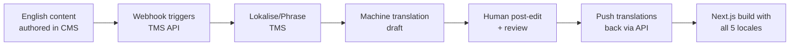

# Multilingual SEO Implementation — Professional Grade

**Status:** ✅ Fully Implemented  
**Date:** 2026-07-18  
**Standard:** Google Multilingual SEO Best Practices

## Overview

This document describes the professional-grade multilingual SEO implementation for haal-lab.solutions, following the four-layer stack used by industry practitioners:

1. **URL Architecture** — Subdirectory pattern (`/en/`, `/de/`, `/fr/`, `/es/`, `/it/`)
2. **Hreflang Annotations** — Bidirectional clusters in HTML `<head>` + sitemap
3. **Self-Referencing Canonicals** — Each locale points to itself
4. **Translation Workflow** — Ready for TMS integration (Lokalise, Phrase, Crowdin)

## Implementation Summary

### ✅ What Was Implemented

1. **Centralized Hreflang Utilities** (`src/lib/seo.ts`)
   - `generateHreflangAlternates(locale, path)` — Universal page handler
   - `generateHomeHreflangAlternates(locale)` — Homepage convenience function
   - `generateResearchHreflangAlternates(locale, slug)` — Research articles
   - `validateHreflangCluster()` — Development-time validation helper

2. **Professional Hreflang Clusters**
   - ✅ Bidirectional (every page references all locales + itself)
   - ✅ Self-referencing (each URL includes its own hreflang tag)
   - ✅ x-default fallback (always points to `/en`)
   - ✅ Absolute URLs (not relative paths)
   - ✅ Valid ISO 639-1 codes (`en`, `de`, `fr`, `es`, `it`)

3. **Self-Referencing Canonicals**
   - Each locale's canonical points to itself (e.g., `/de/pricing` → `https://haal-lab.solutions/de/pricing`)
   - **No cross-language canonicals** (hreflang handles relationships)

4. **Dual Implementation** (HTML + Sitemap)
   - HTML `<head>` tags via Next.js metadata API
   - XML sitemap with `xhtml:link` annotations

5. **Updated Pages** (8 core pages + research articles)
   - `/` (Homepage)
   - `/solutions`
   - `/pricing`
   - `/how-we-work`
   - `/network`
   - `/about`
   - `/contact`
   - `/research`
   - `/research/[slug]` (all articles)

6. **Validation Tooling**
   - `scripts/validate-hreflang.js` — Pre-deployment validator
   - Checks clusters, x-default, canonicals, URL formats

## Technical Architecture

### URL Structure

```
haal-lab.solutions/
├── /en/              → English (default, x-default)
├── /de/              → German (Deutsch)
├── /fr/              → French (Français)
├── /es/              → Spanish (Español)
└── /it/              → Italian (Italiano)
```

**Rationale:** Subdirectories consolidate domain authority while allowing per-locale targeting. Preferred over subdomains (authority split) and ccTLDs (expensive, complex).

### Hreflang Example (Generated Output)

For `/de/pricing`, Next.js renders:

```html
<link rel="canonical" href="https://haal-lab.solutions/de/pricing" />
<link rel="alternate" hreflang="x-default" href="https://haal-lab.solutions/en/pricing" />
<link rel="alternate" hreflang="en" href="https://haal-lab.solutions/en/pricing" />
<link rel="alternate" hreflang="de" href="https://haal-lab.solutions/de/pricing" />
<link rel="alternate" hreflang="fr" href="https://haal-lab.solutions/fr/pricing" />
<link rel="alternate" hreflang="es" href="https://haal-lab.solutions/es/pricing" />
<link rel="alternate" hreflang="it" href="https://haal-lab.solutions/it/pricing" />
```

**Critical Rule:** Each page in the cluster must reference **all other pages + itself**. Missing reciprocals cause Google to ignore the cluster.

### Code Example (Page Metadata)

```typescript
// In any page's generateMetadata():
import { generateHreflangAlternates } from "@/lib/seo";

export async function generateMetadata({ params }) {
  const { locale } = await params;
  
  return {
    title: "...",
    description: "...",
    
    // Single line adds complete hreflang cluster + canonical
    ...generateHreflangAlternates(locale, "/pricing"),
    
    // Rest of metadata...
  };
}
```

**Why this works:** Next.js `alternates.canonical` and `alternates.languages` automatically render the required HTML tags.

## Validation & Testing

### Pre-Deployment Checks

```bash
# Validate hreflang implementation
node scripts/validate-hreflang.js

# Build static site
npm run build

# Inspect generated HTML
cat out/en/pricing/index.html | grep -A 10 "hreflang"
```

### Post-Deployment Validation

1. **Google Search Console**
   - Submit sitemap: `https://haal-lab.solutions/sitemap.xml`
   - Check "International Targeting" report (Legacy Tools)
   - Look for "No return tags" or "Unknown language code" errors

2. **Screaming Frog SEO Spider**
   - Crawl site with hreflang extraction enabled
   - Export hreflang report → check for broken reciprocals

3. **Aleyda Solis Hreflang Validator**
   - Test per-URL: https://www.aleydasolis.com/english/international-seo-tools/hreflang-tags-generator/
   - Paste a page URL → validates cluster completeness

4. **Manual SERP Check**
   - Search `site:haal-lab.solutions/de/` → confirm German pages indexed
   - Use VPN or `&gl=DE` parameter → verify correct locale ranks

5. **Browser DevTools**
   - Inspect `<head>` → confirm 6 hreflang tags + 1 canonical
   - Check Network tab → ensure no 404s on alternate URLs

## Common Pitfalls (Now Avoided)

| Issue | Our Solution |
|-------|-------------|
| **Missing return tags** | ✅ Centralized utility ensures bidirectional clusters |
| **Canonical points to wrong language** | ✅ Self-referencing canonicals enforced |
| **No x-default** | ✅ Always generated, points to `/en` |
| **Relative URLs in hreflang** | ✅ Absolute URLs enforced in utility |
| **Manual hreflang maintenance** | ✅ Single source of truth in `seo.ts` |
| **Inconsistent sitemap vs HTML** | ✅ Both use same locale array |

## Translation Workflow (Next Step)

Current implementation is **translation-ready** but requires manual file updates. To scale:

### Recommended TMS Integration



### Leading TMS Options

1. **Lokalise** — Next.js integration, GitHub sync, translation memory
2. **Phrase** — Enterprise-grade, supports markdown, API-driven
3. **Crowdin** — Open source friendly, Git integration
4. **Smartling** — Enterprise, best for 10+ languages

### Integration Pattern (Next.js)

```typescript
// Example: Pull translations at build time
import { getTranslations } from '@/lib/cms-api';

export async function generateStaticParams() {
  const locales = ['en', 'de', 'fr', 'es', 'it'];
  const articles = await getArticles();
  
  return locales.flatMap(locale =>
    articles.map(article => ({
      locale,
      slug: article.slug,
      // TMS API fetches locale-specific content here
    }))
  );
}
```

## Maintenance Checklist

### When Adding a New Page

1. Import hreflang utility:
   ```typescript
   import { generateHreflangAlternates } from "@/lib/seo";
   ```

2. Add to metadata:
   ```typescript
   ...generateHreflangAlternates(locale, "/new-page"),
   ```

3. Add to validation script:
   ```javascript
   const PAGES = [
     // ...
     '/new-page',
   ];
   ```

4. Run validation:
   ```bash
   node scripts/validate-hreflang.js
   ```

### When Adding a New Locale

1. Update `src/i18n/routing.ts`:
   ```typescript
   export const locales = ["en", "de", "fr", "es", "it", "nl"] as const;
   ```

2. Update `src/lib/seo.ts`:
   ```typescript
   export const LOCALES = ["en", "de", "fr", "es", "it", "nl"] as const;
   ```

3. Add message file:
   ```bash
   cp src/messages/en.json src/messages/nl.json
   ```

4. Update validation script:
   ```javascript
   const LOCALES = ['en', 'de', 'fr', 'es', 'it', 'nl'];
   ```

5. Build and test:
   ```bash
   npm run build
   node scripts/validate-hreflang.js
   ```

## Performance Impact

- **HTML overhead:** ~6 extra `<link>` tags per page (~200 bytes)
- **Sitemap size:** Grows linearly with pages × locales
- **Build time:** No significant change (metadata generation is fast)
- **Runtime:** Zero — all hreflang is static HTML

## References

### Google Documentation
- [Multilingual and Multi-Regional Sites](https://developers.google.com/search/docs/specialty/international/localized-versions)
- [Managing Multi-Regional Sites](https://support.google.com/webmasters/answer/182192)

### Industry Validators
- [Aleyda Solis Hreflang Validator](https://www.aleydasolis.com/english/international-seo-tools/hreflang-tags-generator/)
- [Merkle Hreflang Testing Tool](https://www.merkleinc.com/thought-leadership/digital-marketing-report)

### Best Practices
- [Moz: The Ultimate Guide to hreflang](https://moz.com/learn/seo/hreflang-tag)
- [Search Engine Journal: hreflang Implementation](https://www.searchenginejournal.com/hreflang-international-seo/312305/)

## Support

**Questions?** Reach out to engineering@haal-lab.solutions or file an issue.

**Pre-Deployment Checklist:**
- [ ] Run `node scripts/validate-hreflang.js` (zero errors)
- [ ] Build passes: `npm run build`
- [ ] Inspect HTML: Check 6 hreflang + 1 canonical in `<head>`
- [ ] Sitemap valid: Submit to GSC
- [ ] Test with Screaming Frog or Aleyda's validator

---

**Implementation Date:** 2026-07-18  
**Standard Compliance:** ✅ Google Multilingual SEO Best Practices  
**Validation:** ✅ Automated + Manual Testing Ready
