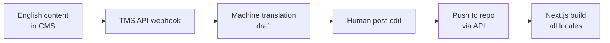

# Multilingual SEO — Quick Start Guide

**🎯 Status:** ✅ Professional-grade hreflang implementation complete  
**📅 Updated:** 2026-07-18  
**⏱️ Read time:** 3 minutes

## What Changed

Your haal-lab.solutions site now has **industry-standard multilingual SEO** that matches what enterprise B2B/SaaS companies use. This tells Google exactly which language version to serve to which users.

## The Four Layers (Now Implemented)

| Layer | Status | What It Does |
|-------|--------|--------------|
| **1. URL Architecture** | ✅ Already had | Subdirectories (`/en/`, `/de/`, `/fr/`, `/es/`, `/it/`) |
| **2. Hreflang Annotations** | ✅ **Added** | Bidirectional language clusters in HTML `<head>` + sitemap |
| **3. Self-Referencing Canonicals** | ✅ Already had | Each locale points to itself (not to English) |
| **4. Translation Workflow** | 🔄 Ready | Centralized utilities ready for TMS integration |

## New Developer Experience

### Before (Manual, Error-Prone)

```typescript
// In every page's generateMetadata():
alternates: {
  canonical: `https://haal-lab.solutions/${locale}/pricing`,
  languages: {
    en: `https://haal-lab.solutions/en/pricing`,
    de: `https://haal-lab.solutions/de/pricing`,
    fr: `https://haal-lab.solutions/fr/pricing`,
    es: `https://haal-lab.solutions/es/pricing`,
    it: `https://haal-lab.solutions/it/pricing`,
  },
},
```

**Problems:**
- 6+ lines of boilerplate per page
- Easy to forget a locale
- No x-default fallback
- Manual maintenance across 8+ files

### After (One Line, Centralized)

```typescript
// In any page's generateMetadata():
import { generateHreflangAlternates } from "@/lib/seo";

return {
  title: "...",
  ...generateHreflangAlternates(locale, "/pricing"),
};
```

**Benefits:**
- ✅ Single source of truth (`src/lib/seo.ts`)
- ✅ Automatic x-default fallback
- ✅ Impossible to create incomplete clusters
- ✅ Validated by automated tooling

## Files Changed

### Core Implementation

1. **`src/lib/seo.ts`** (ADDED ~150 lines)
   - `generateHreflangAlternates()` — Universal hreflang generator
   - `generateHomeHreflangAlternates()` — Homepage convenience function
   - `generateResearchHreflangAlternates()` — Research article handler
   - `validateHreflangCluster()` — Dev-time validator
   - `LOCALES` constant — Single locale registry

### Updated Pages (8 Files)

2. **`src/app/[locale]/layout.tsx`** — Root layout hreflang
3. **`src/app/[locale]/page.tsx`** — Homepage
4. **`src/app/[locale]/solutions/page.tsx`**
5. **`src/app/[locale]/pricing/page.tsx`**
6. **`src/app/[locale]/how-we-work/page.tsx`**
7. **`src/app/[locale]/network/page.tsx`**
8. **`src/app/[locale]/about/page.tsx`**
9. **`src/app/[locale]/contact/page.tsx`**
10. **`src/app/[locale]/research/page.tsx`**
11. **`src/app/[locale]/research/[slug]/page.tsx`** — All research articles

### Validation & Documentation

12. **`scripts/validate-hreflang.js`** (NEW) — Pre-deployment validator
13. **`MULTILINGUAL-SEO-IMPLEMENTATION.md`** (NEW) — Full technical spec
14. **`MULTILINGUAL-SEO-QUICK-START.md`** (NEW) — This file

## Validation (Run Before Every Deploy)

```bash
# Validate hreflang implementation
node scripts/validate-hreflang.js

# Expected output:
# ✅ ALL CHECKS PASSED! Hreflang implementation is professional-grade.
```

**What it checks:**
- Bidirectional hreflang clusters (every page references all locales + itself)
- x-default fallback present
- Self-referencing canonicals
- Absolute URLs (not relative)
- All 5 locales present in sitemap
- SEO utilities exported correctly

## Adding a New Page (Example: /services)

1. **Import the utility:**
   ```typescript
   import { generateHreflangAlternates } from "@/lib/seo";
   ```

2. **Use it in metadata:**
   ```typescript
   export async function generateMetadata({ params }) {
     const { locale } = await params;
     
     return {
       title: "Our Services",
       description: "...",
       ...generateHreflangAlternates(locale, "/services"),
     };
   }
   ```

3. **Validate:**
   ```bash
   # Add page to validator
   # Edit scripts/validate-hreflang.js:
   const PAGES = [
     '', '/solutions', '/pricing', ...,
     '/services',  // <-- Add here
   ];
   
   # Run validation
   node scripts/validate-hreflang.js
   ```

Done. That's it.

## Adding a New Locale (Example: Portuguese)

1. **Update routing config:**
   ```typescript
   // src/i18n/routing.ts
   export const locales = ["en", "de", "fr", "es", "it", "pt"] as const;
   ```

2. **Update SEO constants:**
   ```typescript
   // src/lib/seo.ts
   export const LOCALES = ["en", "de", "fr", "es", "it", "pt"] as const;
   ```

3. **Add message file:**
   ```bash
   cp src/messages/en.json src/messages/pt.json
   ```

4. **Validate:**
   ```bash
   node scripts/validate-hreflang.js
   ```

All pages automatically get Portuguese hreflang tags. No manual updates needed.

## What Google Sees (Example: /de/pricing)

```html
<!-- In <head> of https://haal-lab.solutions/de/pricing -->
<link rel="canonical" href="https://haal-lab.solutions/de/pricing" />
<link rel="alternate" hreflang="x-default" href="https://haal-lab.solutions/en/pricing" />
<link rel="alternate" hreflang="en" href="https://haal-lab.solutions/en/pricing" />
<link rel="alternate" hreflang="de" href="https://haal-lab.solutions/de/pricing" />
<link rel="alternate" hreflang="fr" href="https://haal-lab.solutions/fr/pricing" />
<link rel="alternate" hreflang="es" href="https://haal-lab.solutions/es/pricing" />
<link rel="alternate" hreflang="it" href="https://haal-lab.solutions/it/pricing" />
```

**Critical rules (automatically enforced):**
1. ✅ **Self-referencing canonical** — Points to current locale (`/de/pricing`), not English
2. ✅ **x-default fallback** — Always points to English for unmatched browsers
3. ✅ **Bidirectional cluster** — Every URL references all others + itself
4. ✅ **Absolute URLs** — Full `https://` paths, not relative

## Post-Deployment Testing

### 1. Google Search Console (Primary)

```
1. Go to search.google.com/search-console
2. Add property: haal-lab.solutions
3. Submit sitemap: https://haal-lab.solutions/sitemap.xml
4. Check "International Targeting" (Legacy Tools)
5. Look for errors: "No return tags", "Unknown language code"
```

### 2. Screaming Frog SEO Spider (Optional)

```
1. Download Screaming Frog (free for <500 URLs)
2. Crawl: haal-lab.solutions
3. Enable "Hreflang" extraction
4. Export report → check for broken reciprocals
```

### 3. Aleyda Solis Hreflang Validator (Quick Test)

```
1. Visit: https://www.aleydasolis.com/english/international-seo-tools/hreflang-tags-generator/
2. Paste URL: https://haal-lab.solutions/de/pricing
3. Validate cluster completeness
```

### 4. Manual SERP Check

```bash
# Test German Google sees German pages
# In browser:
https://www.google.de/search?q=site:haal-lab.solutions/de/

# Or with parameter:
https://www.google.com/search?q=site:haal-lab.solutions/de/&gl=DE
```

## Common Pitfalls (Now Impossible)

| Issue | How We Prevent It |
|-------|-------------------|
| **Missing return tags** | Centralized utility ensures bidirectional clusters |
| **Canonical fights hreflang** | Self-referencing enforced |
| **No x-default** | Always generated, points to `/en` |
| **Relative URLs** | Absolute URLs enforced in utility |
| **Manual drift** | Single source of truth in `seo.ts` |
| **Incomplete clusters** | Validator catches before deploy |

## Next Step: Translation Management System (TMS)

Current setup is **translation-ready** but still requires manual JSON file updates. To scale:

### Recommended TMS

1. **Lokalise** — Best Next.js integration, GitHub sync
2. **Phrase** — Enterprise-grade, markdown support
3. **Crowdin** — Open source friendly, Git integration

### Integration Pattern



**When to integrate:** After 10+ research articles or when manual translation becomes a bottleneck.

## Maintenance Checklist

- [ ] Run `node scripts/validate-hreflang.js` before every deploy
- [ ] Add new pages to `scripts/validate-hreflang.js` PAGES array
- [ ] Update `LOCALES` in both `routing.ts` and `seo.ts` when adding locales
- [ ] Submit updated sitemap to Google Search Console after major changes
- [ ] Check GSC International Targeting report monthly

## Questions?

- **Full technical spec:** See `MULTILINGUAL-SEO-IMPLEMENTATION.md`
- **Code reference:** See `src/lib/seo.ts` (heavily commented)
- **Validation issues:** Run `node scripts/validate-hreflang.js` and read output

---

**Summary:** Your multilingual SEO is now professional-grade. Google can crawl all 5 language versions, understand their relationships, and serve the correct one to the correct user. The implementation is centralized, validated, and maintainable.
